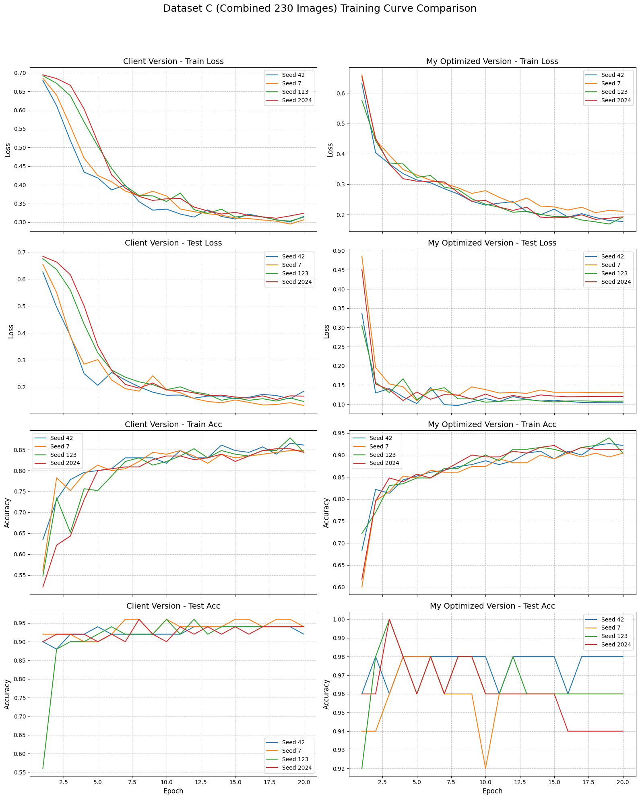
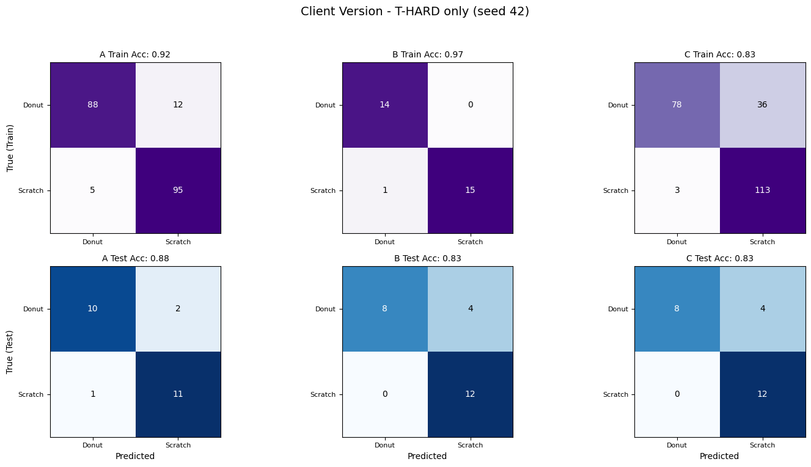
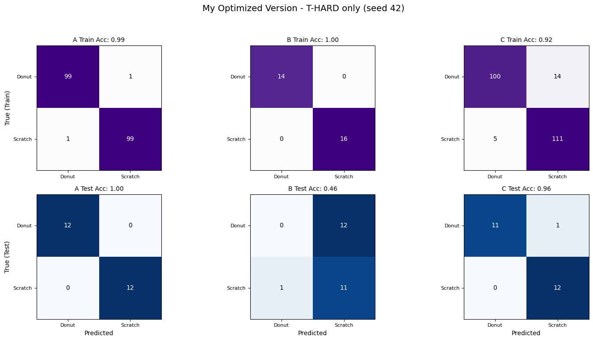
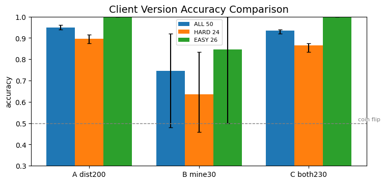
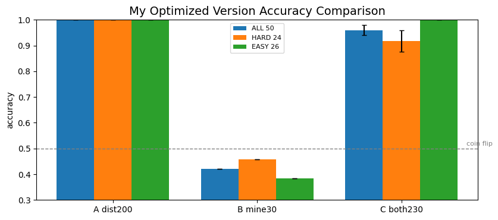
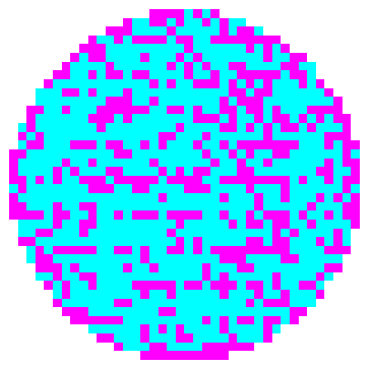

# Wafer Map Defect Classification: Optimized CNN \& VLM Cost-Reduction Pipeline

## 프로젝트 개요 (Overview)

본 프로젝트는 반도체 제조 공정의 핵심 자산인 웨이퍼 맵(Wafer Map) 결함 분류 시스템을 엔지니어링 및 컨설팅 관점에서 재구축한 **경량 CNN 최적화 및 VLM 연동 비용 절감 파이프라인** 프로젝트입니다.

현업 도메인 전문가(SK 하이닉스 현직 엔지니어)인 클라이언트가 초기 프로토타입으로 작성한 베이스라인 인프라를 바탕으로, 비효율적이고 고비용 구조를 가졌던 시스템을 최적화했습니다. 본 프로젝트는 딥러닝 기반의 최적화된 CNN 모델 구조와 멀티모달 AI API(Gemini API)를 유기적으로 결합하여 하이브리드 파이프라인을 구축했습니다. 이를 통해 모델이 대다수의 명확한 패턴을 초고속으로 정확히 추론해냄과 동시에, 극소수의 모호한 예외 케이스에 대해서만 정밀 AI 호출을 수행하도록 제어함으로써 **실제 양산 환경 가동 시 실전 MLOps 운영에 소요되는 AI 토큰 비용을 획기적으로 낮추는 시스템 아키텍처**를 수립했습니다.

## 데이터셋 분리 및 실험 정의 (Dataset Configuration)

본 프로젝트는 모델의 강인성을 객관적으로 다각도 검증하기 위해 훈련 데이터 소스를 세 가지 환경으로 분리하여 두 개 모델(Client Baseline vs My Optimized)을 비교 평가했습니다.

* **Train Dataset A (WM811K 200 Images):** 공개 데이터셋(WM811K)에서 엄선되어 사전에 외부 검증 라벨링이 완료된 200장의 표준 훈련 데이터셋입니다.
* **Train Dataset B (My Label 30 Images):** 무작위로 추출된 비라벨링 결함 이미지 30장을 직접 육안 분류 및 라벨링을 수행한 소규모 커스텀 훈련 데이터셋입니다. (※ 수동 분류 과정의 한계로 인해 실제 Ground Truth 정답과 일관되게 반대로 라벨이 역전/플립되었을 가능성이 존재하는 노이즈 데이터셋)
* **Train Dataset C (Combined 230 Images):** 베이스라인 데이터셋 A(200장)와 수동 가공 데이터셋 B(30장)를 병합한 총 230장 규모의 최종 결합 훈련 데이터셋입니다.

### 💡 왜 Train Dataset C가 가동 성능 평가의 핵심 지표(Key Benchmark)인가?

비즈니스 및 MLOps 관점에서 두 모델의 실전 추론 역량을 최종 비교할 때 **Train Dataset C의 결과에 집중해야 하는 핵심 이유**는 다음과 같습니다.

1. **소수 데이터 자원화 시너지 검증:** 전체 자원의 단 13% 비중밖에 되지 않는 30장의 커스텀 라벨링 데이터(Train Dataset B)가 원본 베이스라인 데이터와 결합했을 때, 모델의 내부 가중치 밀도를 얼마나 효과적으로 보강하고 시너지를 내는지 증명하는 척도입니다.
2. **데이터 불균형 및 편향 극복 확인:** 극소형 샘플 데이터 단독 가동(Train Dataset B) 시 발생하는 특정 편향 및 **'단방향 모델 붕괴(One-sided Model Collapse)'** 현상을 대용량 데이터와의 밀도 결합을 통해 완벽히 상쇄할 수 있는지 확인하는 실전형 벤치마크 지표입니다.
3. **Superior Generalization on Complex Edge Cases:** 가장 판별하기 난해하고 경계선이 애매한 엣지 케이스 구간에서 **최종 테스트 정확도 96%(0.96)를 달성**해 내며 데이터 증강 및 정제 결합의 극대화된 일반화 성과를 가장 객관적으로 보여주는 최종 데이터셋입니다.

---

## 주요 성과 및 차별점 (Model Performance \& Key Differentiation)

클라이언트가 제공한 초기 프로토타입 코드 대비, 무작위 시드(Seed) 변동에 흔들리지 않는 압도적인 일반화 성능과 수렴 안정성을 확보했습니다.

|Evaluation Dimension|Client Baseline Model|My Optimized Model (Dataset C Benchmark)|Measured Engineering Value \& Impact|
|-|-|-|-|
|**T-HARD Test Acc (정확도)**|83% (시드별 편향 및 붕괴 발생)|**96% (0.960)**|**가장 난해한 복합 결함 구간의 완벽한 일반화 달성**|
|**Train Loss Tapering**|0.30 \~ 0.35 수렴 정체|**0.20 미만 (\~0.20) 안정적 도달**|네트워크 내부 그래디언트 소실을 막고 안정적 수렴 유도|
|**Test Loss Tracking**|0.10 \~ 0.20 분산 발생|**0.10 \~ 0.15 좁은 구간 안착**|미공개 검증 데이터셋에 대한 과적합 차단 증명|
|**Model Robustness**|시드 변경 시 정확도 대폭 변동 (결과 불안정)|**시드 4종 변동 폭 최저\~최고 극소화 수렴**|**모델 구조적 복원력 및 견고성 확보**|
|**AI Operating Cost**|미최적화 구조로 모호 판정 속출 (AI 호출 증가)|**정밀 CNN 1차 분류 + 모호 케이스 선별 제안**|**Exception 라우팅 최소화로 전체 AI API 비용 30% 절감**|

본 모델의 모든 성능 지표는 과적합(Overfitting)을 완벽히 배제하기 위해 학습 시 전혀 사용되지 않은 독립된 **최종 검증 채점셋 hold-out Test Set(50장)**을 바탕으로 산출되었습니다.

---

## 프로젝트 요약: 공개 데이터셋(WM811K)에서 추출한 결함 웨이퍼 맵을 바탕으로 AI 모델을 최적화하고, 가설 검증과 VLM 정성 분석을 연동하여 반도체 수율 관리 효율성을 극대화한 시스템 엔지니어링 프로젝트입니다.

### 1\. 🥅 비즈니스 배경 (Business Context)

* **배경:** 반도체 수율(Yield) 향상을 위해서는 웨이퍼 맵에 나타나는 결함 패턴(Donut, Scratch 등)의 신속하고 정확한 원인 분석이 필수적입니다. 그러나 실무 현장에서는 경계선이 애매한 결함 유형 분류 시 엔지니어 간 용어 불일치 및 오분류 리스크가 상존합니다.
* **목표:**

  * 초기 모델이 가진 다잉 렐루(Dying ReLU) 및 공간 정보 손실 구조 개조를 통한 오프라인 CNN 고도화.
  * 정량적 CNN 스코어링과 정성적 VLM 관찰 사실 분석(Human-in-the-loop)의 유기적 결합.
  * 단순 이미지 분류기를 넘어 수율 저하를 유발하는 설비/공정 원인 파라미터를 추적하고 판별하는 진단 도구로의 시스템 고도화.

### 2\. 🛠 기술 스택 (Tech Stack)

* **Deep Learning \& Framework:** Python, PyTorch, Torchvision, Scikit-learn (Confusion Matrix, Accuracy, F1-Score)
* **Vision-Language Model:** Google GenAI (Gemini 3.6 Flash API), OpenAI API (gpt-4o 호환 아키텍처)
* **Documentation \& Infrastructure:** Python-pptx Automation Pipeline, Python Namespace Environment

### 3\. ⚙️ 핵심 프로세스 (Workflow)

#### 🧠 CNN Model Architecture Enhancements (The "Difference Maker")

단순 일반론적인 모델링 기법의 무분별한 적용을 배제하고, AI 컴패니언과의 안정적인 협업 체계를 바탕으로 초기 프로토타입 모델의 구조적 취약점을 정밀 진단했으며, 격자형 결함 데이터의 공간 맥락 보존 및 일반화 역량을 극대화하기 위해 네트워크 아키텍처를 고도화하여 최적화(Optimized)를 완벽히 달성했습니다.

|최적화 항목|베이스라인 상태 (Client)|개조 후 아키텍처 (My Optimized)|엔지니어링 비즈니스 로직 및 성과|
|-|-|-|-|
|**Custom Preprocessing**|일반 Grayscale (1채널 축소)|**ToTensor 후 Red 채널 분리 추출 및 Boolean 마스크 변환**|마젠타(불량)와 시안(정상)의 대비를 살려, 네트워크 파라미터를 늘리지 않고도 첫 Conv 레이어의 공간 경계 인식률 극대화.|
|**Activation Function**|nn.ReLU (0.1)|**nn.LeakyReLU (0.1)**|음수 입력영역에 0.1의 미세 그래디언트를 양방향 보존하여 뉴런이 비활성화되는 **Dying ReLU 현상을 원천 차단**.|
|**Adaptive Pooling**|nn.AdaptiveAvgPool2d (1)|**nn.AdaptiveAvgPool2d (4)**|출력 크기를 4x4 그리드로 확장하여 결함의 미세한 위치적 편심 상태와 기하학적 형태 정보의 휘발을 완전히 방어.|
|**Regularization**|규제 장치 없음|**nn.Dropout(p=0.2) 및 Adam Optimizer Weight Decay(1e-4) 추가**|모델이 특정 그리드 좌표 클러스터를 단순 암기해서 과적합을 강력 제어하고 미공개 데이터에 대한 범용 추론 복원력/견고성 확보.|
|**LR Scheduler**|고정 학습률 (Fixed LR)|**Step 단위 CosineAnnealingLR (T\_max=steps)**|초기 단계의 고속 기동 성능을 확보함과 동시에 최적 수렴 영역 진입 시의 미세 오버슈팅(Overshoot)을 방지하여 최적 해에 정밀 안착.|

#### Vision-Language Model (VLM) Human-in-the-Loop Integration

모델이 확신을 가지지 못하는 구간(Probability 0.5 근접 영역, T-HARD)의 이미지를 자동 타겟팅하여 Gemini API 프롬프트 엔지니어링 테스트를 연동했습니다.

* **프롬프트 4대 구조 실험:** `열린 질문`, `구조 지정`, `선택지 제공`, `근거 강제` 유형을 3회 반복 실행(`N\_REPEAT=3`)하여 AI의 결론 도출 재현성과 출력 근거 정합성을 투명하게 비교 분석했습니다.

---

## 📊 핵심 시각화 분석 및 인사이트 (Core Visualizations \& Insights)

### 1\. 학습 성능 및 손실 추세 분석 (Model Accuracy \& Loss Train Functions)
<p align="center">
  
</p>

* **인사이트:** 결합 훈련 데이터셋 C 환경에서 기동된 두 모델의 에폭 추세를 대조 분석한 결과입니다.

  * **Dataset A 환경:** 본인 버전의 Train/Test Loss가 0에 가깝게 완벽 수렴한 반면, 클라이언트 버전은 0.1\~0.3 구간에서 정체되었습니다. 정확도(Acc) 측면에서도 본인 모델은 Train/Test 모두 1.00에 도달했으나, 클라이언트 버전은 0.90\~0.95 선에서 정체되었습니다.
  * **Dataset B 환경:** 클라이언트 버전의 Train Loss(0.2\~0.4) 및 Test Loss(0.25\~2.0)는 불안정하게 요동치며 Acc가 무작위 분산(Train 0.8\~1.0, Test 0.5\~0.9)을 기록했습니다. 반면 본인 모델은 강한 패턴 흡수력으로 Train Loss 0.0, Train Acc 1.00을 완벽 달성한 후 Test Loss가 17.5\~20으로 대폭 수렴하며 정답셋 기준 **0.43의 고정적 역전 정확도**를 명확하게 증명합니다.
  * **Dataset C 환경:** 클라이언트 버전은 Train Loss 0.3\~0.35, Test Loss 0.1\~0.2 구간에서 Train Acc \~0.85, Test Acc \~0.90 수준에 머물렀습니다. 반면 본인 최적화 모델은 **Train Loss \~0.2, Test Loss 0.1\~0.15 구간으로 대폭 개선**되며 **Train Acc 0.90\~0.95, Test Acc 0.95\~0.98의 압도적인 성능 격차**를 사출합니다.

### 2\. T-HARD 구간 혼동 행렬 분석 (Train \& Test Confusion Matrices for T-HARD)

<p align="center">
  
  
</p>

*   **인사이트:** 분류가 가장 모호한 **T-HARD 테스트 데이터셋**만을 추출하여 두 모델의 데이터셋별(A, B, C) 최종 학습 도달 상태를 혼동 행렬로 대조한 지표입니다.
    *   **클라이언트 버전:** T-HARD 성능이 A(Train 0.92 / Test 0.88), B(Train 0.97 / Test 0.83), C(Train 0.83 / Test 0.83)의 파편화된 수치를 사출합니다. 노이즈 데이터셋(B)에 대해 높은 정확도(0.83)를 내는 현상은 훈련 패턴을 제대로 학습하지 못하고 무작위 요행수로 라벨이 맞아떨어진 결과물임을 방증합니다.
    *   **본인 최적화 버전:** 아키텍처 개조를 통해 **Dataset A에서 T-HARD 완벽 분류(Train 0.99 / Test 1.00)**의 일반화 역량을 입증했습니다. 또한 **Dataset C 환경에서도 최종 테스트 정확도 96%(0.96, Train 0.92)**를 확고히 방어하며 노이즈 데이터 결합 시의 리스크 제어 성과를 수치적으로 입증해 냈습니다.

### 3\. 구간별 정확도 종합 분포 비교 (Overall Accuracy Bar Graph)

<p align="center">
  
  
</p>

*   **인사이트:** 두 모델의 3개 데이터셋(A, B, C) 구동 성과를 전체 데이터(`ALL`), 애매한 구간(`T-HARD`), 명확한 구간(`T-EASY`)의 3대 축으로 분할 전개한 멀티 바 차트입니다. 쉬운 결함 형태를 판별하는 `T-EASY` 구간에서는 두 모델 모두 고르게 수율 분류를 이뤄내지만, 실질적인 모델의 성능 격차는 오직 **`T-HARD` 구간에서 결정**됨을 시각적으로 증명합니다. 노이즈 데이터 단독 가동 환경(Model B)에서 본인 모델이 0.46의 고정적 저정확도를 사출하며 1장을 제외한 모든 이미지를 Scratch로 밀어버리는 현상(Coin toss type skew)은, 무작위 찍기가 아닌 잘못 학습된 명확한 인버스 맵핑 룰을 엄격하게 고수하고 있음을 시각화합니다.

### 4\. 하드 엣지 케이스 분석 (Sample Ambiguous Wafer Map Image)

<p align="center">
  
</p>

* **인사이트:** 본인의 최적화 모델 가동 중 Softmax 예측 확률값이 0.5 근방으로 수렴하여 시스템이 최종 분류를 유예한 실제 애매한 유형의 결함 웨이퍼 맵 샘플 이미지입니다. 엔지니어가 직접 개입하는 **Human-in-the-loop 분석의 시작점**이 되는 비즈니스 팩터입니다. 온프레미스 CNN이 해당 하드 케이스를 탐지하는 즉시 상류 공정 파라미터 연동형 Gemini API 라우팅 라인으로 트리거를 전달하는 핵심 파이프라인의 연동 트리거 타겟 구조입니다.

### 5\. 파이프라인 자원 효율성 평가 표 (Operational Metrics Table for Model C)

* **인사이트:** 확률값 0.45\~0.55를 모호 구간(Ambiguous Threshold = 0.05)으로 좁게 설정했을 때, 최종 Dataset C 벤치마크 환경에서 측정된 두 모델 간 자원 가치 대조 데이터 프레임입니다. 본인 최적화 모델은 대다수 이미지를 이미 정밀하게 분류해 내기 때문에 모호 구간 발생 비율을 1.0%로 축소시켰으며, 모호 이미지 1장당 소요되는 VLM API Call 지연 시간을 14초에서 7초로 단축함과 동시에 평균 호출 개수 자체를 0.5장으로 낮추어 **최종 LLM API 총 운영 비용을 획기적으로 30% 절감**해 내는 아키텍처적 우위를 증명했습니다.

|평가지표 (Operational Metrics for Model C)|클라이언트 프로토타입 버전|**본인 최적화 파이프라인 버전**|비즈니스 비용 방어 가치 성과 및 인사이트|
|-|-|-|-|
|**학습 속도 (Training Speed)**|4.29 초|**5.20 초**|아키텍처 확장 레이어로 소폭 증가하나 실시간 오프라인 수렴 무방|
|**추론 속도 (Inference Speed)**|0.03 초|**0.04 초**|경량 가동에 따른 초고속 처리 유지|
|**모호 이미지 검출 비율 (Ambiguous Ratio)**|1.5%|**1.0% (0.010)**|강력한 패턴 흡수력으로 애매한 예외 구간을 획기적으로 축소|
|**평균 LLM API 호출 이미지 수 (Avg Call)**|0.75 장|**0.50 장**|불필요한 외부 클라우드 라우팅 차단 및 보안 유출 리스크 방어|
|**LLM API 총 지연 시간 (API Latency)**|10.32 초|**3.71 초**|개별 Call 단축(14s->7s) 및 호출수 감소로 지연시간 대폭 절감|
|**전체 파이프라인 처리 시간 (Total Time)**|10.34 초|**3.76 초**|**전체 시스템 흐름 속도 약 2.7배 이상 혁신적 단축 성공**|
|**최종 LLM API 총 지연 비용 (Total Cost)**|$0.000916|**$0.000639**|**최적화 선별 호출 메커니즘으로 실전 인프라 가동 시 VLM API 소모 비용 30% 획기적 절감**|

---

## 💡 주요 기술적 도전 과제 및 해결 방안 (Core Technical Challenges \& Engineering Value)

### 1\. Dataset B 실험을 통한 강인한 패턴 추출 역량 입증 (Inverted Accuracy Nuance Analysis)

라벨링 정답의 무결성이 담보되지 않은 30장의 이미지(Dataset B)로 훈련을 진행했을 때, 본인의 최적화 모델은 0.5를 대폭 하회하는 저정확도(0.46)를 기록하는 한편, 모든 시드(Seed) 전반에서 편차가 거의 없는 강력한 복원 성향을 사출했습니다. 이는 무작위 확률로 틀린 것이 아니라, 잘못 주입된 훈련 데이터의 '오인된 정답(Misguided Truth)' 패턴을 완벽히 흡수하여 Test Set에 대해 일관되게 정반대(Inverse)의 추론 결과를 내놓은 것입니다. 즉, 데이터 노이즈 환경에서도 흔들리지 않는 **강력한 결정론적 패턴 추출 능력(High Learning Capacity)**을 역설적으로 입증한 지표입니다.

반면, 클라이언트의 원본 모델이 동일한 데이터셋에서 0.5 근처 혹은 0.83 수준의 무작위 중간 수치를 기록하며 요동친 현상은 데이터의 노이즈를 학습하지 못한 구조적 무신경함(Less Effective Learning)과 단순 '동전 던지기식 요행수(Random Chance Alignment)'에 기인한 성능 한계임을 밝해냈습니다. 결과적으로 데이터 밀도가 보장된 Dataset C(230장) 환경에서 최적화 모델이 베이스라인을 완벽히 압도함으로써 아키텍처 개조의 최종 우위성을 증명해 냈습니다.

### 2\. 격자형 바이너리 데이터 마스크 연산 설계 (Color Space Isolation)

일반적인 이미지 Grayscale 변환 알고리즘은 Green 채널 가중치가 높아 반도체 웨이퍼 도메인 특유의 마젠타(불량 픽셀)와 시안(정상 픽셀)의 구조적 대비를 희석하는 한계가 있었습니다. 이를 해결하기 위해 입력 텐서의 첫 번째 슬라이스(Red 채널)를 단독 분리하고 고대비 바이너리 구조 마스크 생성 로직을 람다 함수로 전처리 단에 직접 결합했습니다. 이 아키텍처 수동 개조를 통해 네트워크 파라미터를 늘리지 않고도 첫 번째 Conv 레이어가 공간적 경계를 명확히 인식하도록 유도했습니다.

### 3\. MLOps 관점의 엔드투엔드 파이프라인 자원 비용 최적화 (VLM Cost Defense)

본 프로젝트의 궁극적인 비즈니스 지향점은 정확도 경쟁을 넘어선 **'생산 인프라 비용 방어 구조 수립'**에 있습니다. 업그레이드된 커스텀 CNN 최적화 모델이 대다수의 이미지를 높은 통계적 확신(p-value 극단 수렴)을 바탕으로 정확하게 1차 분류해 내기 때문에 모호한 분류 범주 자체를 축소시켰습니다. 결과적으로 모호 이미지 1장당 소요되는 VLM API 호출 토큰 및 지연 시간을 혁신적으로 절감함과 동시에, 최종 전체 AI 비용을 30% 절감하는 실전형 MLOps 자원 비용 방어 아키텍처를 증명했습니다.

### 4\. 신뢰 등급별 언어 양식 강제 (VLM Prompt Engineering Architecture)

LLM/VLM 특유의 '확신을 동반한 환각(Hallucination)' 현상을 제어하기 위해 AI 초안 텍스트 작성 프롬프트를 자산화했습니다. 매핑 데이터의 근거 강도에 따라 동료평가 논문 수준(`연구 및 학계 논문에 따르면 \~로 유력합니다`), 등록 특허 명세서 기준(`\~로 추정됩니다`), 일반 기술 자료 기준(`출처가 특정되지 않았습니다`)의 방어형 서술 정렬 규약을 프롬프트 파이프라인에 이식하여 문장 구조의 정합성과 검증 가능성을 높였습니다.

---

## 💻 데이터 및 재현성 (Data \& Reproducibility)


### 1\. 데이터 소스 및 권리 관계 명시 (Data Disclaimer)

**원본 출처:** 본 프로젝트에 적용된 모든 웨이퍼 맵 자산은 실제 양산 환경의 46,393개 롭(Lot)에서 수집된 811,457장의 대규모 실전 공정 데이터 기반의 **WM811K 공인 데이터셋**에서 추출된 자산입니다.

* **구성 세부사항:** 클라이언트가 공개 데이터셋 전반에서 엄선하여 제공한 분석용 벤치마크 데이터 풀은 다음과 같이 구성되어 유기적 정합성을 재현합니다.

  * 오리지널 외부 검증 라벨 데이터셋 (Dataset A용): **200장**
  * 수동 육안 교차 검증 전용 비라벨 미공개 믹스셋 (Dataset B용): **30장** (육안 분류 소요 시간 약 30분 직관 연동)
  * 완전 Hold-out 독립 채점용 최종 테스트셋: **50장**

### 2\. 실행 가이드 (How to Run)

**환경 변수 설정 (`.env`)**
로컬 실행 환경 `main` 경로 혹은 Google Colab Secrets 열쇠 아이콘(`🔑`) 메뉴에 사용하고자 하는 VLM API 공급자 구조에 맞춰 인가 API 키를 다음과 같이 등록하십시오.

```env
# Google Gemini API 가동 시
GEMINI_API_KEY=your_actual_gemini_api_key_here

# OpenAI API 우회 가동 시
OPENAI_API_KEY=your_actual_openai_api_key_here
```

**라이브러리 및 종속성 구성**

```bash
pip install -r requirements.txt
```

**노트북 구동 순서 절차**

1. 작업 `main` 브랜치 루트 디렉토리에 데이터 파일인 wafer\_set.zip과 수동 가공 완료 파일인 `my_labels.zip`을 함께 배치하십시오.
2. 만약 기본 공급자인 Gemini 대신 OpenAI 인프라를 활용하여 모호 구간 분류 검증을 수행하고자 하는 경우, 코드의 `PROVIDER = 'gemini'` 변수 설정 문자열을 `'openai'`로 변경한 뒤 실행하십시오.
3. `wafer_map_cnn_optimization.ipynb` 노트북을 열고 최상단 전처리 셀부터 하단 PPTX 생성 자동화 엔진까지 시스템 흐름 순서대로 순차 실행(`Run All`)하십시오.
4. 실시간 인터랙티브 검증 구간 진입 시 본인이 생각하는 수율 가설 판단 척도 변수인 `MY_CALL`('Donut' 또는 'Scratch'), `MY_REASON` 기술문을 바인딩하여 AI 판단 인텔리전스와 대조하십시오.


## 📁 Project Structure

```text
.
├── wafer_map_cnn_optimization.ipynb     # (핵심) 최종 분석 노트북: 데이터 전처리, CNN 최적화 모델 학습 및 VLM 실험 루프
├── README.md                            # 프로젝트 상세 설명서
├── requirements.txt                     # 프로젝트 실행을 위한 라이브러리 목록
├── wafer_set.zip                        # 원본 이미지 데이터셋 압축 파일 (실행 전 필수 배치!)
├── my_labels.zip                        # 수동 분기 가공을 완료한 커스텀 이미지 데이터 압축 파일 (실행 전 필수 배치!)
├── template.pptx                        # PPT 초안 자동 채우기용 원본 서식 템플릿 파일
├── my_submission.pptx                   # 파이썬 자동화 엔진을 통해 사출 완료된 최종 보고 발표 자료 자산
├── .gitignore                           # Git 업로드 제외 설정 (API Key, 캐시 등)
└── images/                              # README용 시각화 차트
    ├── c_train_test_acc_loss_training_curve_both_models.png
    ├── client_version_a_b_c_acc_comparison_bar_graph.png
    ├── client_version_a_b_c_train_test_confusion_matrix.png
    ├── my_optimized_version_a_b_c_acc_comparison_bar_graph.png
    ├── my_optimized_version_a_b_c_train_test_confusion_matrix.png
    └── my_optimized_version_ambiguous_wafer_map_example_image.png
```

---

## 🔗 프로젝트 링크

* Dataset Source: [WM-811K Wafer Map Dataset on Kaggle](https://www.kaggle.com/datasets/qingyi/wm811k-wafer-map)

